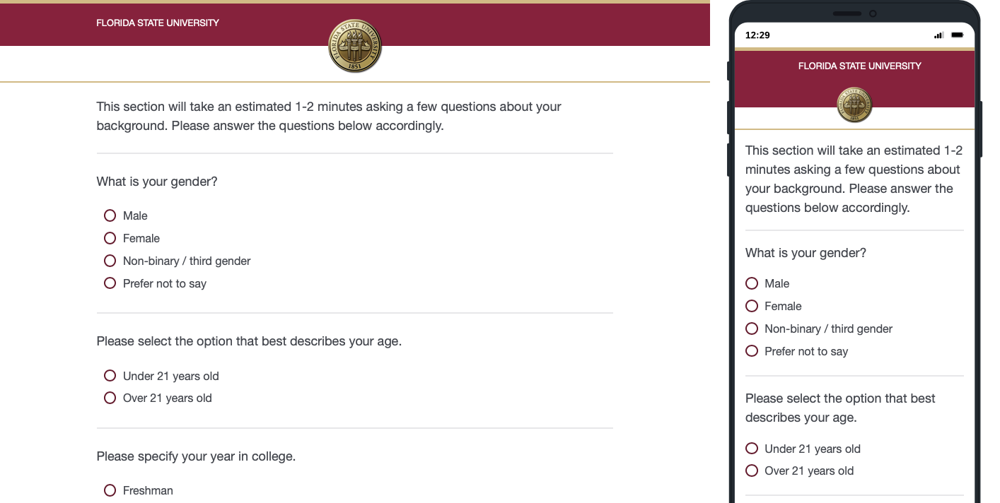

# Project: Survey Analytics for Local Business
A group project focused on engineering a customer survey in order to address important questions for a local business.
## Project Overview
This is a project completed for my Marketing Research class, in which I helped engineer a survey designed to measure customer retention and attendance for a local restaurant's various deals and events. The ultimate goal was to perform statistical analyses on survey data in order to determine the effectiveness of their marketing, and use said results in order to provide a reccomendation to the local business.

* Designed a survey in Qualtrics designed to capture customer demographics as well as their responsiveness to various aspects of the local restaurant's marketing and events.
* Distributed survey to over 100 students across campus.
* Exported data into SPSS for statistical analysis.
* Performed statistical analyses in order to come to conclusions:
  * Student customers averaged around one day per week at the restaurant.
  * Customers preferred deals or events that provided tangible savings on drinks, rather than on food.
  * Customers valued the overall experience and atmosphere as the least important.
* Reccomneded that the restaurant fill their days of the week that don't have events, with deals that offer tangible savings on drinks.

## Survey

A link to a preview of the published survey can be found [here](https://fsu.yul1.qualtrics.com/jfe/preview/previewId/4722b649-5bbc-4d56-bd0c-f7f3b483525e/SV_b9nJh2FZImkzTLw?Q_CHL=preview&Q_SurveyVersionID=current)

)
A link to the response data of the survey used for the analysis can be found [here](https://github.com/pcm19b/Project-Survey-Analytics/blob/7a86967523f02d6b71adee755c2a2d345462df76/Default%20Report.pdf)

## Analysis and Report
A link to the final report including analyses and reccomendations can be found [here](https://github.com/pcm19b/Project-Survey-Analytics/blob/a53c3b4b336af7983b66a87bbd08c07b67412382/MAR%204613%20Paper.pdf)
